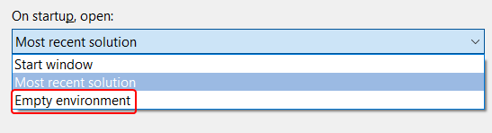
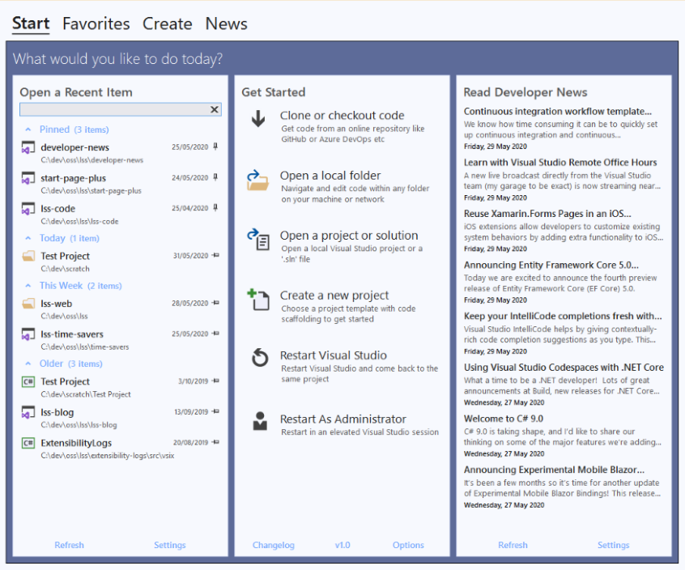

# Start Page+

*Bring back Start Page+!*

![Version][version-badge-url]
![Installs][installs-badge-url]
![Rating][rating-badge-url]
[![License][license-badge]][license-url]
[![Donate][paypal-badge]](https://www.paypal.me/yannduran/5)

[version-badge-url]: http://vsmarketplacebadge.apphb.com/version-short/YannDuran.StartPagePlus.svg?label=version&colorB=7E57C2&style=flat-square
[installs-badge-url]: http://vsmarketplacebadge.apphb.com/installs-short/YannDuran.StartPagePlus.svg?colorB=7E57C2&style=flat-square
[rating-badge-url]: http://vsmarketplacebadge.apphb.com/rating-short/YannDuran.StartPagePlus.svg?colorB=7E57C2&style=flat-square
[license-badge]: https://img.shields.io/badge/license-MIT-7E57C2.svg?style=flat-square
[license-url]: https://github.com/luminous-software/start-page-plus/blob/master/LICENSE
[paypal-badge]: https://img.shields.io/badge/donate-paypal-green.svg?style=flat-square
[paypal-url]: https://www.paypal.me/yannduran/10

You can download this extension [from the Visual Studio Marketplace][marketplace-url].

[marketplace-url]: https://marketplace.visualstudio.com/items?itemName=YannDuran.StartPagePlus

---

## Bring Back Start Page!

When Visual Studio 2019 was released, many developers were dismayed to find that the _Start Page_ had been completely
replaced by the new _Start Window_ (a big **modal** dialog window, with no room for _Developer News_).

## Introducing Start Page+

So many of you, in **so many posts** in the Developer forum, **pleaded** for Microsoft to bring back the Visual Studio 2017
_Start Page_, and unfortunately those please fell on deaf ears.

Well, you asked and now _Start Page+_ delivers!

The [Start Page+][start-page-plus-url] extension adds a new *Start Page* that is a **dockable tool window**,
not a **modal** window.
It's been written **from the ground up**, and doesn't rely on any of Visual Studio's *internal* code.
So it can't be taken  away by Microsoft. And it's open source!

To open the new _Start Page+_ window:

- make sure Visual Studio's *Start Window* is disabled
  - in **Tools** | **Options** | **Environment** | **Startup** select _Empty Environment_

    

- select **View** | **Start Page+**

  

The Start Page+ window is accessed from the **View** menu, because it makes sense.
It's also easy to remember because you think "I want to **view** the start page",
you don't think "I want to **file** the start page.

The Visual Studio 2010-2017's _Start Page_ was always in the **View** menu,
until Microsoft moved it to the **File** menu, which never made any sense.

[start-page-plus-url]: https://marketplace.visualstudio.com/items?itemName=YannDuran.StartPagePlus
[roadmap-url]: https://luminous-software.solutions/start-page-plus/roadmap
[give-back-start-page-url]: https://developercommunity.visualstudio.com/idea/434456/start-page-please-give-it-back.html

## More Information

You can read more about _Start Page+_ on its website:

[Overview][website-url] **|** [Getting Started][getting-started-url] **|** [Features][features-url] **|** [Changelog][changelog-url] **|** [Roadmap][roadmap-url]

[website-url]: https://luminous-software.solutions/start-page-plus
[getting-started-url]: https://luminous-software.solutions/start-page-plus/getting-started
[features-url]: https://luminous-software.solutions/start-page-plus/features
[changelog-url]: https://luminous-software.solutions/start-page-plus/changelog
[roadmap-url]: https://luminous-software.solutions/start-page-plus/roadmap

## Support the Project

If *Start Page+* has saved you time and hassle, please come back and show your support:

  - you could [***rate *Start Page+****][rate-or-review-url] (only takes a couple of seconds)
  - or [***review *Start Page+****][rate-or-review-url] (help others benefit from your experience)
  - or [***shout me a coke***](https://www.paypal.me/yannduran/5) (I don't drink coffee or beer lol)

[rate-or-review-url]: https://marketplace.visualstudio.com/items?itemName=YannDuran.StartPagePlus#review-details

## Contribution Guidelines

Check out the [contribution guidelines][contributing-url]
if you'd like to contribute to this project.

[contributing-url]: https://github.com/luminous-software/start-page-plus/blob/master/.github/CONTRIBUTING.md

## License

This project is licensed under the MIT License - [click here][license-url] for details

---

    

