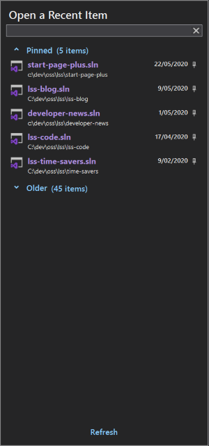
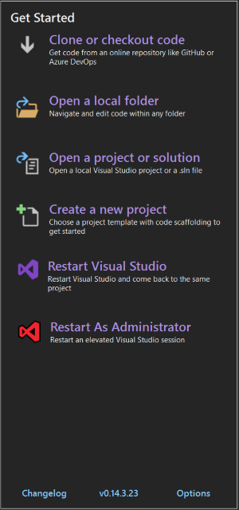
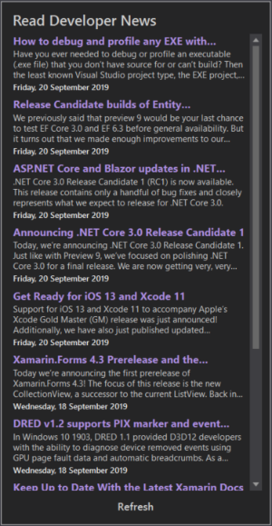
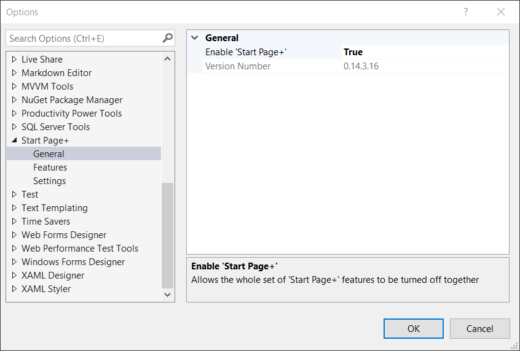
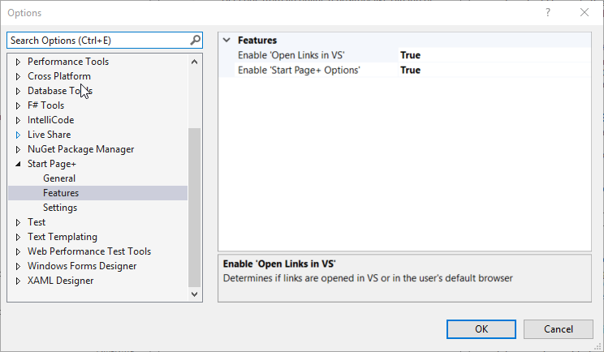
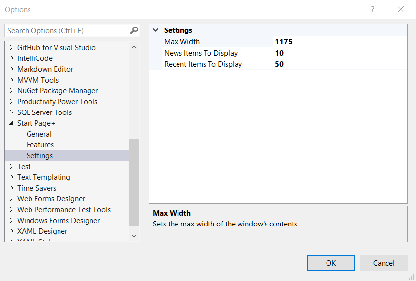

To display the new *Start Page+* window:

- click **View** | **Start Page+**

## Recent Items

The *Recent Items* list brings back the ability to filter the list of recent items,
and the grouping by timeframe that we had in VS 2017.

### Filter List

By typing a name, or a partial name, into the filter box above the list display just the items
that match the filter.

### Collapsible/Expandable Timeframe Groups

Each timeframe group can be collapsed or expanded by clicking anywhere on the group name.
This can come in handy if you want to view items that are currently not being displayed
without having to scroll down.

### Pin/Unpin Items

Right-click an unpinned item in the *Recent Items* list, and select *Pin item* to pin it.
Right-click on a pinned item in the *Recent Items* list, and select *Unpin item** to unpin it.

### Remove Items

Right-click any item in the *Recent Items* list, and select *Remove item* to remove it.

## Start Actions

The *Start Actions* list gives new users a simplified way to get to their code, the same as in VS 2019's
*Start Window*.

- clone or checkout code
- open a local folder
- open a project or solution
- create a new project
- restart Visual Studio
- restart Visual Studio as Administrator

It also has a handy, but non-intrusive way to see what version of *Start Page+* is currently installed.
Clicking on the link will open the *change log* page,
so you can easily see what's changed in the new version.

## Developer News

The *Developer News* feed brings back VS 2017's handy list of Microsoft developer-related news items that was removed from
VS 2019.
I don't know how many times I've seen something that interests me that I might have missed if I hadn't seen it on my
start page.

By default the items open right in VS itself, rather than switching to the default browser.
Personally, I prefer having to switch applications as little as possible.
When I'm working in Visual Studio, I prefer to stay in Visual Studio, and not have my attention derailed by having
to switch to a different application, and then back again to Visual Studio.

However, for those people who prefer links to be opened in their default browser,
there's an option to change Start Page+'s behavior to do just that.

## General Options

### Enable 'Start Page+'

This setting allows _Start Page+_ to be *turned off*, without having to uninstall the _Start Page+_ extension,
which would require you to exit **all** instances of Visual Studio, wait while the _VSIX installer_ does its thing,
then open Visual Studio again.

If you're worried about the _Start Page+_ extension still using resources, once you enable this setting,
the _View_ | _Start Page+_ and the _Tools_ | _Start Page+ Options_ menu items will no longer be available,
so the extension will have no need to be loaded.

However, instances of any tool window are never _destroyed_ when they're _closed_, so until you close Visual Studio there will
be some remaining resources being used. But the next time you start Visual Studio, there'll be no way to open
the _Start Page+_ window, so the extension will not need to be loaded.

### Version Number

This setting simply displays the version number of _Start Page+_ that's currently installed.

## Feature Options

### Enable 'Open Links in VS'

When this setting is set to `true`, any clicked item that opens a web page will be opened in a browser window
**inside** of Visual Studio.

When set to `false`, clicked items that open a web page will be opened in your default browser.

### Enable 'Start Page+ Options'

When this setting is set to `true` a 'Start Page+ Options' command is added to the `Tools` | `Options` menu.

## Setting Options

### Hide Recent Item Extensions

This setting allows to either hide a project/solution's extension in the *Recent Items* list.

### Max Width

The default value of 1175 should be fine for everyone, regardless of your monitor resolution.
However if you'd like the contents of the _Start Page+_ window to be wider or narrower,

### News Items to Display

This setting will allow you to determine how many items are displayed in the *Developer News* list.

The default value is 10.

### Recent Items to Display

This setting will allow you to determine how many items are displayed in the *Recent Item* list.

The default value is 50.
The default value is `true`.