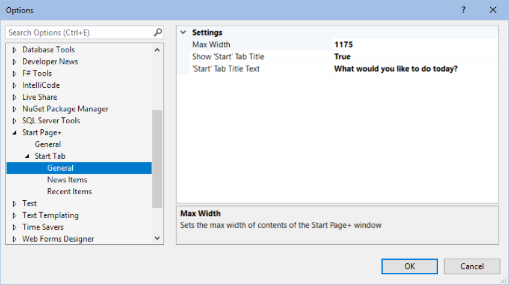
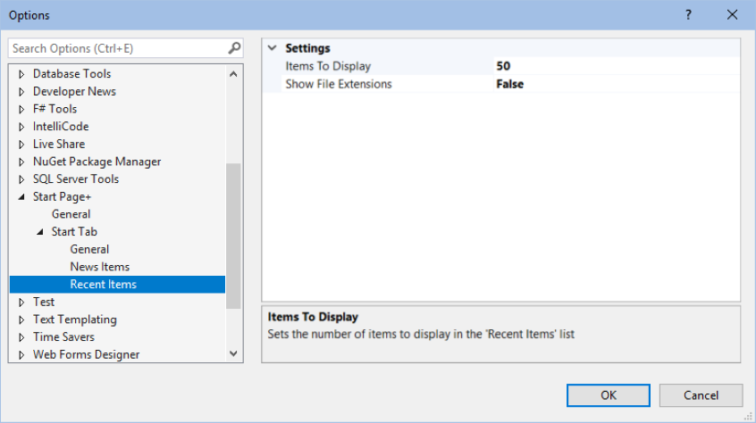
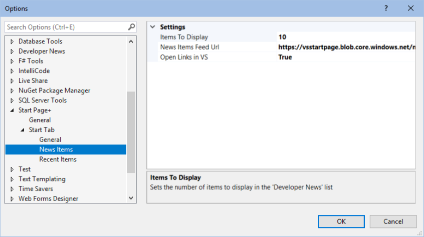

To display the new *Start Page+* window:

- click **View** | **Start Page+**

## Recent Items

The *Recent Items* list brings back the ability to filter the list of recent items,
and the grouping by timeframe that we had in VS 2017.

### Live Filtering

Type a name, or a partial name, into the filter box above the list to display just the matching items
as you type.

Click the **X** in the filter box to start again, or to go back to the full list of items.

### Collapsible Timeframes

Each timeframe group can be collapsed or expanded by clicking anywhere on the group name.
This can come in handy if you want to view items that are currently not being displayed
without having to scroll all the way down.

### Pin/Unpin An Item

Right-click an ***unpinned*** item in the *Recent Items* list, and select *Pin item* to ***pin*** it.
Or click on the icon to the right of the date.

Right-click on a ***pinned*** item in the *Recent Items* list, and select *Unpin item* to ***unpin*** it.
Or click on the icon to the right of the date.

### Remove An Item

Right-click any item in the *Recent Items* list, and select *Remove item* to remove it.

### Copy An Item's Path

Right-click any item in the *Recent Items* list, and select *Copy item path* to copy it
path to the Windows clipboard. You can then paste it anywhere you need to.

### Refresh

When you select the number of items to display, you'll need to click the *Refresh* button to see
the change.
It's also a quick way to expand all of the timeframe groups at once.

### Settings

Clicking on the *Settings* button will open the *Recent Items* settings page in the
Tools | Options | Start Page+ dialog without having to navigate through teh dropdowns.

## Start Actions

The *Start Actions* list gives new users a simplified way to get to their code, the same as in VS 2019's
*Start Window*. Plus a few extras.

### Clone Or Checkout Code

Quickly get code from an online repository by entering the repository location.
You can also browse GitHub or Azure DevOps repositories from here,
which will take you to the *Connect* dialog.

### Open A Local Folder

Open any folder on your local machine, or on a network share.
Here *local* basically just means '*not in the cloud*'.

### Open A Project Or Solution

A quick way to get to the *Open Project/Solution* dialog without having to use `File` | `Open` | `Project/Solution`.

### Create A New Project

A quick way to get to the *New Project* dialog without having to use `File` | `New` | `Project`.

### Restart Visual Studio

Any time you need to restart Visual Studio you can do it from the *Start Page+* window in just one click.
No need to close and re-open Visual Studio manually.

### Restart As Administrator

You can also restart Visual Studio as Administrator without having to you through the hassle of finding
and right-clcking a Visual Studio shortcut etc.

Note: if you launch Visual Studio as Administrator, you can't get back to a non-elevated session by
clicking on *Restart Visual Studio*.
There doesn't seem to be a programmatic way to force an elevated session to restart as a normal session.

### Changelog Button

With just a single-click you can see what's changed in the new version of *Start Page+*.

### Version Number

This is a subtle way of being able to see the version number of the currently installed version of
*Start Page+*.

Clicking on the version number will open the website's Overview page.
On there you can see what the latest available version of *Start Page+* is at the top of the page.

### Options Button

Clicking on the *Options* button is a quick way to get to the *Start Page+* options page without
having to use `Tools` | `Options` | `Start Page+`.

## Developer News

The *Developer News* feed brings back VS 2017's handy list of Microsoft developer-related news items that was removed from
VS 2019.
I don't know how many times I've seen something that interests me that I might have missed if I hadn't seen it on my
start page.

### Set Items Feed Url

By default the feed url is set to the url of the original *Developer News* that used to be in Visual Studio 2017.
Microsoft is currently still maintaining that feed, but could stop doing so at any time.
You could choose to use the *Visual Studio Blog* feed url instead if you wanted.

In the past the two feeds have displayed a different set of posts,
with Visual Studio Blog having more posts that the Developer News feed.
But it seems that may currently have the same items.

The *Visual Studio Blog* feed url is `https://devblogs.microsoft.com/visualstudio/feed`.

### Set Items to Display

You can choose the number of items that are displayed in the list.

There are only 10 items in the orginal feed, and Microsoft replaces older posts with new ones.
If you set a feed url to something that has a lerger number of items you might want to limit
how many are downloaded and displayed.

### Open Links in VS or Browser

By default the items open right in VS itself, rather than switching to the default browser.
Personally, I prefer having to switch applications as little as possible.
When I'm working in Visual Studio, I prefer to stay in Visual Studio, and not have my attention derailed by having
to switch to a different application, and then back again to Visual Studio.

However, for those people who prefer links to be opened in their default browser,
there's an option to change Start Page+'s behavior to do just that.

### Refresh

There is currently no auto-refresh for *Developer News*, so you'll have to click *Refresh* to
check if you have the latest available news items from Microsoft.

Also, when you select the number of items to display, you'll need to click the *Refresh* button
to see the change.

## General Options

### Enable 'Start Page+'

This setting allows _Start Page+_ to be disabled if you need to,
without having to uninstall the _Start Page+_ extension, which would require you to exit
**all** instances of Visual Studio, wait while the _VSIX installer_ does its thing,
then open Visual Studio again.

### Enable 'Start Page+ Options'

By default, a 'Start Page+ Options' command is added to the `Tools` | `Options` menu.
This setting lets you choose to not have the menu item added.

The default value is `true`.

### Version Number

This setting simply displays the version number of _Start Page+_ that's currently installed.

## Start Tab Options

### Max Width

This setting will allow you to make the contents of the _Start Page+_ window wider or narrower

The default value is `1175`.

### Show Start Tab Title

This setting determines whether the *Start* tab title is displayed.

The default value is `true`.

### Start Tab Title

This setting will allow you to change the *Start* tab title.

The default value is `What would you like to do today?`.

## Recent Items Options

### Items to Display

This setting will allow you to determine how many items are displayed in the *Recent Item* list.

The default value is `50`.

### Show File Extensions

This setting allows to hide a project/solution's extension (.csproj, .sln) in the *Recent Items* list.

The default value is `false`;

## Developer News Options

### Items to Display

This setting will allow you to determine how many items are displayed in the *Developer News* list.

The default value is `10`.

### Items Feed Url

This setting allows you to change the feed url for *Developer News* to any RSS feed that you choose.

The default value is `https://vsstartpage.blob.core.windows.net/news/vs`.

### Open Links in VS

When this setting is set to `true`, any clicked item that opens a web page will be opened in a browser window
**inside** of Visual Studio.

When set to `false`, clicked items that open a web page will be opened in your default browser.

The default value is `true`.
