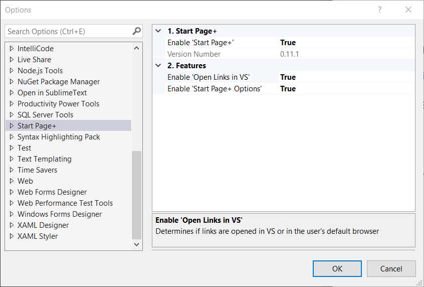

To display the new *Start Page+* window:

- click **View** | **Start Page+**

## Options

### Enable 'Start Page+'

This setting allows the whole set of _Start Page+_ features to be turned off together.

### Version Number

Displays then version number of _Start Page+_ that's currently installed.

### Enable 'Open Links in VS'

The default value is `true`, meaning that any item link that is clicked will be opened in a window
inside of Visual Studio.

A value of `false` will result in the link being opened in your default browser.