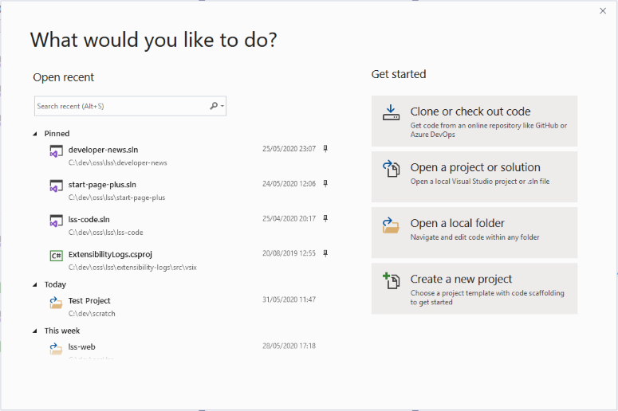
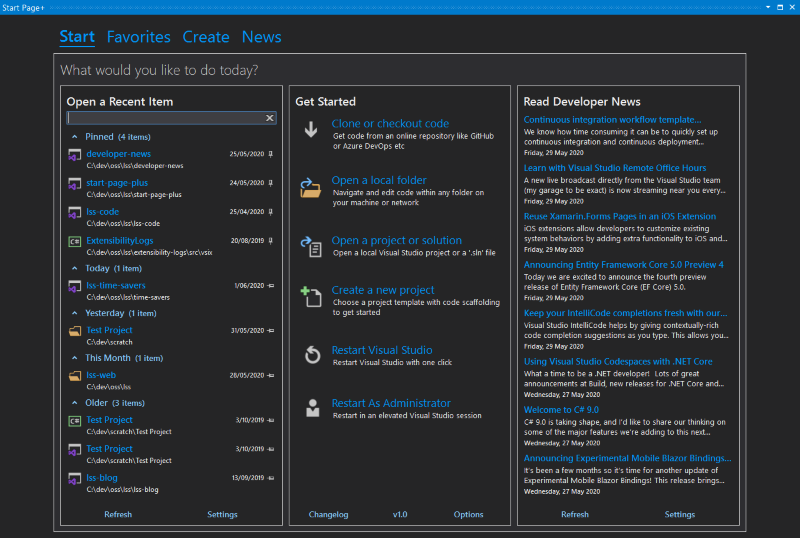
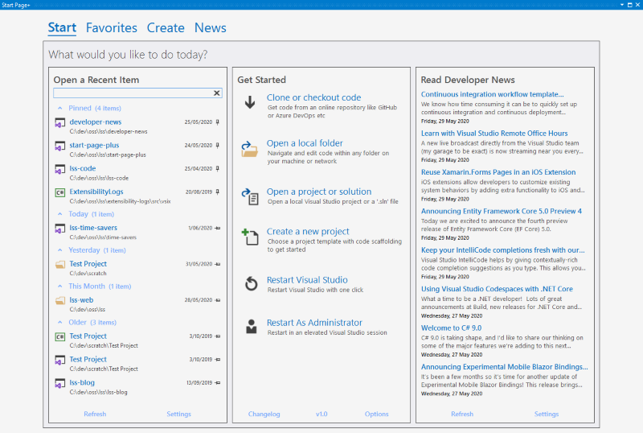
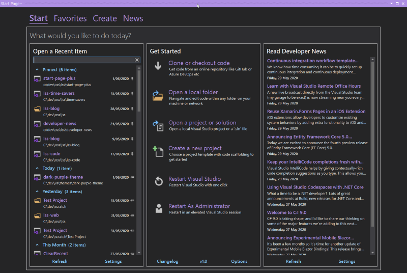

![Version][version-badge-url]
![Installs][installs-badge-url]
![Rating][rating-badge-url]
[![License][license-badge]](https://github.com/luminous-software/start-page-plus/blob/master/LICENSE)
[![Donate][paypal-badge]](https://www.paypal.me/yannduran/5)

[version-badge-url]: http://vsmarketplacebadge.apphb.com/version-short/YannDuran.StartPagePlus.svg?label=version&colorB=7E57C2&style=flat-square
[installs-badge-url]: http://vsmarketplacebadge.apphb.com/installs-short/YannDuran.StartPagePlus.svg?colorB=7E57C2&style=flat-square
[rating-badge-url]: http://vsmarketplacebadge.apphb.com/rating-short/YannDuran.StartPagePlus.svg?colorB=7E57C2&style=flat-square
[license-badge]: https://img.shields.io/badge/license-MIT-7E57C2.svg?style=flat-square
[license-url]: https://github.com/luminous-software/start-page-plus/blob/master/LICENSE
[paypal-badge]: https://img.shields.io/badge/donate-paypal-green.svg?style=flat-square
[paypal-url]: https://www.paypal.me/yannduran/10

You can download this extension [from the Visual Studio Marketplace][marketplace-url]

If *Start Page+* has saved you time and hassle, please come back and show your support:

  - you could [***rate *Start Page+****][rate-or-review-url] (only takes a couple of seconds)
  - or [***review *Start Page+****][rate-or-review-url] (help others benefit from your experience)
  - or [***shout me a coke***](https://www.paypal.me/yannduran/5) (I don't drink coffee or beer lol)

[rate-or-review-url]: https://marketplace.visualstudio.com/items?itemName=YannDuran.StartPagePlus#review-details
[marketplace-url]: https://marketplace.visualstudio.com/items?itemName=YannDuran.StartPagePlus

## Please Note

- **feedback is welcome**, just use the [GitHub Issues][github-issues-url] page
for new features, enhancements, bugs etc
- please consult the [Roadmap][roadmap-url] page, or the [GitHub Issues][github-issues-url] page
**before** you add an issue
- for any known issues, please consult the _Start Page+_ website's [Known Issues][known-issues-url] page

[github-issues-url]: https://github.com/luminous-software/start-page-plus/issues
[known-issues-url]: https://luminous-software.solutions/start-page-plus

---

## Bring Back Start Page!

When Visual Studio 2019 was released, many developers were dismayed to find that the _Start **Page**_
had been completely replaced by a new _Start **Window**_ (a big **modal** dialog window,
with no _Developer News_).

## Introducing Start Page+

So many of you, in **so many posts** in the [Developer Community forum][developer-community-forum-url], **pleaded** for Microsoft to bring back the Visual Studio 2017
_Start Page_, and unfortunately those pleas fell on deaf ears.

[developer-community-forum-url]: https://developercommunity.visualstudio.com/search.html?f=&type=question+OR+problem+OR+idea&type=question+OR+problem+OR+idea&c=&redirect=search%2Fsearch&sort=relevance&q=start+page

Well, you asked for it, and now _Start Page+_ delivers it. All that was taken away,
**plus** more! (get it?)

[Start Page+][start-page-plus-url] is a start page replacement
that is a **dockable tool window**, not a **modal window**.
It's been written **from the ground up**, and doesn't rely on any of Visual Studio's *internal* code.
So it can't be taken  away by Microsoft. And it's open source!

For a complete list of *Start Page+*'s features, including images, [click here][features-url] to go to
the *Features* page on the *Start Page+* website.

[features-url]: https://luminous-software/start-page-plus/features.md

### To Open The Start Page+ Window

- make sure Visual Studio's *Start Window* is disabled
    - in **Tools** | **Options** | **Environment** | **Startup** select _Empty Environment_

    

- click on **View** | **Start Page+**

The _Start Page+_ window is accessed from the **View** menu, because it just *makes sense*.
It's also easy to remember because you think "*I want to **view** the start page*",
you don't think "*I want to **file** the start page*".

The Visual Studio 2010-2017's _Start Page_ was always in the **View** menu,
until Microsoft moved it to the **File** menu in later versions of VS 2017,
and then permanently in VS 2019, which never really made **any** sense to me.

[start-page-plus-url]: https://marketplace.visualstudio.com/items?itemName=YannDuran.StartPagePlus
[roadmap-url]: https://luminous-software.solutions/start-page-plus/roadmap
[give-back-start-page-url]: https://developercommunity.visualstudio.com/idea/434456/start-page-please-give-it-back.html

---

## Theme Samples

### Built-in themes

#### Blue Theme

#### Dark Theme

#### Light Theme

### Custom Themes

*Start Page+* will use colors from any custom theme.

#### Dark Purple

This is my custom *Dark Purple* theme, based on the built-in *Dark* theme.

#### Original Blue Theme (from VS 2017)

Mads Kristensen wrote an extension called [Original Blue Theme][original-blue-theme-extension]
to bring back the original theme from VS 2017.

[original-blue-theme-extension]: https://marketplace.visualstudio.com/items?itemName=MadsKristensen.BlueColorTheme

### Color Theme Editor Themes

The [Color Theme Editor for Visual Studio 2019][color-theme-editor-extension]
extension adds more themes to choose from, and lets you create your own themes (which is what I did).
However Microsoft has now marked it *deprecated*, advising users to use
[Visual Studio Color Theme Designer][vs-color-theme-designer-extension] instead.
However I've found it extremely frustrating, and had no success creating a decent custom theme.

[color-theme-editor-extension]: https://marketplace.visualstudio.com/items?itemName=VisualStudioPlatformTeam.VisualStudio2019ColorThemeEditor
[vs-color-theme-designer-extension]: https://marketplace.visualstudio.com/items?itemName=ms-madsk.ColorThemeDesigner

#### Green Theme

#### Purple Theme

#### Red Theme

#### Tan Theme

